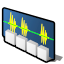

 **Samedi** for [Haiku](https://www.haiku-os.org)

* * *

Samedi is a little app to load audio samples into up to 8 pads and assign them to MIDI notes. The samples can then be played back by pressing the set key on your MIDI keyboard. Alternatively Samedi also reacts to the number keys on your computer keyboard.

For more information, especially how to decrease latency, please see the [Samedi help file](http://htmlpreview.github.io/?https://github.com/humdingerb/samedi/master/documentation/ReadMe.html).

## Building Samedi

It's very easy, just a ```make``` followed by ```make bindcatalogs``` to include translations.

For the Help menu to work, the contents of the "documentation" folder needs to be copied to, for example, ```/boot/home/config/non-packaged/documentation/packages/Samedi```.
